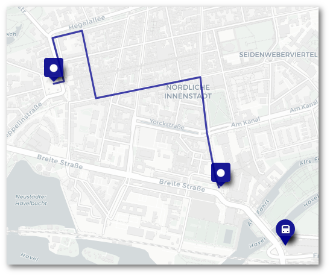

# Potsdam für ein freies Internet

## 23.03.2019 - 10:00 Uhr Luisenplatz

## Gegen Artikel 11 und 13

Die EU-Urheberrechtsreform schreibt vielen Internetseiten und Apps vor, von Nutzerinnen hochgeladene Inhalte auf Urheberrechtsverletzungen zu prüfen. Praktisch allen Plattformen, die Nutzerinneninhalte hosten, droht damit die Pflicht, Uploadfilter einbauen zu müssen. Dieses neue Urheberrecht macht nicht nur Nutzerinnen, sondern auch Urheberinnen das Leben schwer.

**Uploadfilter sind gefährlich für das freie Netz.** Sie richten sich direkt gegen netzkulturelle Phänomene, gegen Meme, Youtube-Videos, Remixe und all den Spaß, den viele so lieben. Sie richten sich gegen Innovation, gefährden neue und alte Projekte. Sie richten sich aber auch gegen das freie Wort. Zum Beispiel treffen sie Whistleblowerinnen, die geschütztes Material zur Aufdeckung von Missständen hochladen. Sie stärken die Macht der großen Konzerne gegenüber Newcomern. Und das sind nur die unmittelbaren Auswirkungen.

**Urheberinnen profitieren von dem aktuellen Gesetzesentwurf nicht!** Das Leistungsschutzrecht in Artikel 11 soll vor allem Verlagen neue Einnahmen sichern. Artikel 12 benachteiligt Autorinnen, Kreative und andere Urheberinnen. Und die Uploadfilter in Artikel 13 schützen nicht etwa die eigentlichen Urheberinnen, sondern sie behindern ihre Arbeit.

**Netz-Biotope sind bedroht.** Viele kleinere Plattformen können den technischen Aufwand für derartige Filter gar nicht leisten. Schier unendlich ist die Anzahl der urheberrechtlich geschützten Werke, gegen die jeder einzelne Upload geprüft werden muss. Sie werden daher gezwungen sein, die Filter an externe Dienstleister wie Google auslagern zu müssen. Und sie haften für den Inhalt der Nutzerinnen.

**Journalismus ist kein Beifang.** Aber die Upload-Filter machen Fehler. Automatisierte Filter sind überhaupt nicht in der Lage, den Kontext von Inhalten einzuschätzen und daher sehr fehleranfällig. Sie können weder zwischen Urheberrechtsverletzungen und schöpferischen Adaptionen unterscheiden, noch zwischen Terrorpropaganda und Berichterstattung über Terrorismus. Die Plattform Youtube, die solche Filter bereits auf freiwilliger Basis einsetzt, sperrte zehntausende Videos, die Kriegsverbrechen dokumentierten, weil in ihnen IS-Flaggen zu sehen waren.

**Meinung braucht keine Auto-Korrektur.** Mit wenig Aufwand kann die jetzt aufzubauende Upload-Infrastruktur auch für ganz andere Zwecke missbraucht werden: Was heute für die Durchsetzung von Urheberrechten genutzt wird, kann morgen schon für die Unterdrückung missliebiger politischer Meinung und Information genutzt werden. Sind die Uploadfilter einmal da, werden sie Begehrlichkeiten wecken bei allen, denen Demokratie und Meinungsfreiheit schon immer ein Dorn im Auge war. Die geplante EU-Verordnung gegen Terrorpropaganda ist da nur der erste Schritt.

**Wir haben kein Vertrauen in Black-Boxes.** Die geplanten Uploadfilter werden massive Auswirkungen auf die Meinungs- und Pressefreiheit haben. Der Zivilgesellschaft fehlen dabei sämtliche demokratische Kontrollmöglichkeiten, um Missbrauch zu verhindern, denn die Algorithmen der Filter sind nicht öffentlich einsehbar. Dafür legt die Einführung einer automatisierten Inhaltskontrolle auf vielen Internetplattformen und Apps den technischen Grundstein für eine mögliche Zensur- und Kontrollinfrastruktur.

Und sie hilft dabei noch nicht einmal den Urheberinnen, eine faire Entlohnung zu bekommen.

Wir wollen uns nicht filtern lassen.

Wir wollen kein europäisches Leistungsschutzrecht.

Wir fordern die Abgeordneten des Europaparlamentes auf, die EU-Urheberrechtsreform in der jetzigen Fassung abzulehnen!

Starten Sie einen neuen Anlauf für eine Reform, die Grund- und Freiheitsrechte nicht bedroht!

Dafür werden wir im Namen der Demokratie und des freien Internets am Samstag, den 23. März um 10 Uhr auf die Straße gehen!

## Demo Route

[Zur Karte](http://umap.openstreetmap.fr/en/map/routenplanung-23032019_297763)

## Hintergrund

### Leistungsschutzrecht (Art. 11)

* Die Wiedergabe von mehr als „einzelnen Worten oder sehr kurzen Textausschnitten“ von Nachrichten wird eine Lizenz erfordern. Darunter fallen wahrscheinlich viele jener Anreißer, die heute üblicherweise als Teil eines Links angezeigt werden, um darzustellen, wohin dieser führt. Gerichte werden letztendlich interpretieren müssen, was „sehr kurz“ in der Praxis heißt – bis dahin wird beim Setzen von Links (mit Anreißern) große Unsicherheit herrschen.
    
* Keine Ausnahmen selbst für Dienste, die von Einzelpersonen oder Kleinunternehmen betrieben werden – darunter fallen wahrscheinlich auch Blogs und Webseiten, die auf irgendeine Weise monetarisiert werden (also Werbung enthalten o.Ä.).

Den kompletten Text zu Artikel 11 findet ihr [hier als pdf](https://juliareda.eu/wp-content/uploads/2019/02/Art_11_unofficial.pdf).

Das Leistungsschutzrecht hat seinen Ursprung im deutschen Leistungsschutzrecht, daher ist der folgende Beitrag des "Elektrischen Reporters" leider auch heute wieder aktuell.

<iframe class="embed-responsive-item" src="https://www.youtube-nocookie.com/embed/ph3XfZvpIZo" frameborder="0" allow="accelerometer; autoplay; encrypted-media; gyroscope; picture-in-picture" allowfullscreen></iframe>

### Uploadfilter (Art. 13)

* Kommerzielle Webseiten und Apps, wo Nutzer*innen Beiträge veröffentlichen können, müssen „bestmögliche Anstrengungen“ unternehmen, vorab Lizenzen zu erwerben für alles, was ihre Nutzer*innen möglicherweise posten könnten – also: alle Inhalte der Welt, die unter das Urheberrecht fallen. Eine unmögliche Aufgabe.

* Zusätzlich müssen alle Dienste außer die allerkleinsten und allerneuesten alles in ihrer Macht stehende tun, um Inhalte von Vornherein zu blockieren, bei denen es sich um unerlaubte Kopien handeln könnte. Sie müssen aktiv nach Kopien von Werken (und Teilen davon) Ausschau halten, die Rechteinhaber bei ihnen hinterlegt haben. Das geht nur mit Uploadfiltern, die naturgemäß sowohl sehr teuer als auch sehr fehleranfällig sind.

* Sollte ein Gericht jemals feststellen, dass ein Dienst nicht genügend Anstrengungen zur Lizensierung oder Filterung unternommen hat, wird dieser für Urheberrechtsverletzungen seiner Nutzer*innen direkt haftbar gemacht, als ob die Betreiberfirma sie selbst begangen hätte. Diese Drohung wird dazu führen, dass Dienste bei der Befolgung des Gesetzes sogar überschießen werden, um auf der sicheren Seite zu sein – mit um so mehr Einschränkungen für unsere Redefreiheit.

Den kompletten Text zu Artikel 11 findet ihr [hier als pdf](https://juliareda.eu/wp-content/uploads/2019/02/Art_13_unofficial.pdf).

Zu den Uploadfiltern gibt es auch wieder ein schönes Video von Alexander Lehmann.

<iframe class="embed-responsive-item" src="https://www.youtube-nocookie.com/embed/X9SVf57ii1w" frameborder="0" allow="accelerometer; autoplay; encrypted-media; gyroscope; picture-in-picture" allowfullscreen></iframe>

## Code of Conduct

Innerhalb des Demobündnisses legen wir Wert darauf, dass Menschen unabhängig von Geschlecht, sexueller Orientierung, Herkunft, Glauben, Aussehen, Religion oder Alter ohne Belästigungen demonstrieren können. Wir dulden keine sexistischen, rassistischen, homo- oder transfeindlichen, ableistischen oder anderweitig marginalisierte Gruppen diskriminierenden Äußerungen – auch nicht, wenn sie „nur als Witz“ gedacht waren.

Wenn ihr Euch belästigt oder bedrängt fühlt findet ihr bei allen als Ordner*Innen gekennzeichnete Menschen Hilfe.

Teilnehmer*Innen die gegen diese Regeln eines respektvollen Miteinanders verstoßen werden von der Veranstaltung ausgeschlossen.

## Kontakt

art13-potsdam@systemli.org

PGP: [65C5 87F4 B085 7B4C](65C587F4B0857B4C.asc)
